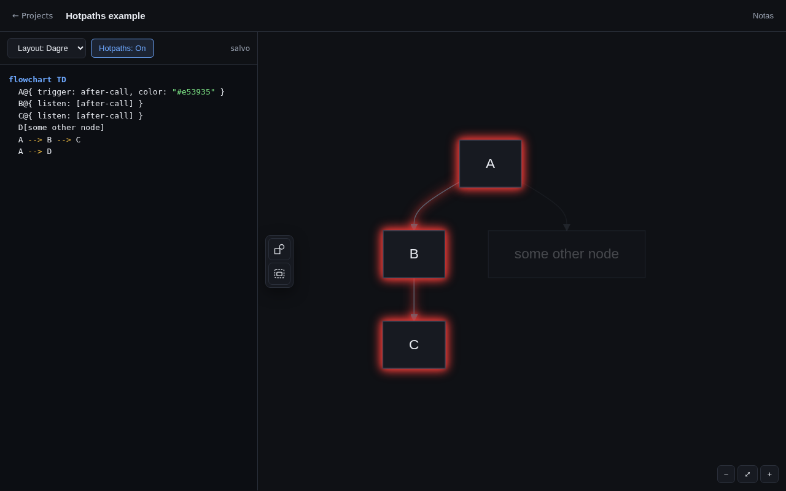

# Mermaid Hotpaths

A hand-built visual editor for [Mermaid](https://mermaid.js.org) flowcharts, with one feature
Mermaid itself doesn't have: **hotpaths** — hover a trigger node and watch every node and edge
downstream of it light up, so a dense flowchart reads as a set of traceable paths instead of a
wall of boxes.

**[Open the editor →](https://alecell.github.io/mermaid-hotpaths/)** — no install, no login,
runs entirely in your browser.



## What's in here

- **A from-scratch node/edge editor** (`playground/`) — drag nodes and edges, resize, relink,
  rename in place, per-element notes, undo/redo, pan/zoom, dark theme — all built directly on
  top of Mermaid's own SVG output, no diagramming library underneath.
- **Hotpaths**, a small extension to Mermaid's flowchart syntax and renderer
  (`packages/mermaid/src/diagrams/flowchart/hotpaths.ts`): declare a `trigger` on a node and
  `listen` for it on others, and hovering (or clicking, to pin) the trigger node highlights
  every member of that trigger's path with a colored glow.
  ```
  flowchart TD
    A@{ trigger: after-call, color: "#e53935" }
    B@{ listen: [after-call] }
    C@{ listen: [after-call] }
    A --> B --> C
  ```
- **A fix for `mermaid-layout-elk`**, the ELK-based layout engine — clusters were emitting a
  broken DOM id, which this repo's `packages/mermaid-layout-elk` corrects.

This is a small, focused fork of [mermaid-js/mermaid](https://github.com/mermaid-js/mermaid)
v11.15.0 — the whole diff outside `playground/` is under 500 lines, confined to the flowchart
diagram and the ELK layout package. Everything else Mermaid ships (all its other diagram
types, docs, its own test suite) is untouched and simply carried along as a dependency of the
two packages above.

## Running it locally

```sh
pnpm install
pnpm dev
```

Opens the editor at `http://localhost:9000`. Project saves go to a small local file-backed API
in this case (`playground-data/`, gitignored); the same editor also runs with **zero backend**
(see below), which is how the hosted version above works.

```sh
pnpm build
```

Builds the two Mermaid bundles the editor imports directly
(`packages/mermaid/dist/mermaid.esm.mjs`, `packages/mermaid-layout-elk/dist/mermaid-layout-elk.esm.mjs`).

## How saving works

The editor auto-detects whether it's talking to a real backend. Locally (`pnpm dev`), it uses
the small Express API above. On a static host like GitHub Pages, where there's no backend to
call, it falls back to the browser's `localStorage` automatically — same UI, same features,
just per-browser storage. Use the **Export JSON** / **Import JSON** buttons on the projects
page to move your diagrams between browsers or back them up.

## License

MIT — see [LICENSE](LICENSE). This project is a derivative of
[mermaid-js/mermaid](https://github.com/mermaid-js/mermaid), © Knut Sveidqvist and
contributors, also MIT licensed.
